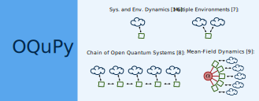

# OQuPy: Open Quantum Systems in Python

**A Python 3 package to efficiently compute non-Markovian open quantum systems.**

[](https://mybinder.org/v2/gh/tempoCollaboration/TimeEvolvingMPO/master?filepath=tutorials%2Ftutorial_01_quickstart.ipynb)
[](https://www.travis-ci.com/tempoCollaboration/TimeEvolvingMPO)
[](https://codecov.io/gh/tempoCollaboration/TimeEvolvingMPO)
[](https://timeevolvingmpo.readthedocs.io/en/latest/?badge=latest)
[](code_of_conduct.md)
[](https://www.zenodo.org/badge/latestdoi/244404030)

[](http://unitary.fund)

This open source project aims to facilitate versatile numerical tools to efficiently compute the dynamics of quantum systems that are possibly strongly coupled to structured environments. It allows to conveniently apply several numerical methods related to the time evolving matrix product operator (TEMPO) [1-2] and the process tensor (PT) approach to open quantum
systems [3-5]. This includes methods to compute ...

- the dynamics of a quantum system strongly coupled to a bosonic environment [1-2].
- the process tensor of a quantum system strongly coupled to a bosonic environment [3-4].
- optimal control procedures for non-Markovian open quantum systems [5].
- the dynamics of a strongly coupled bosonic environment [6].
- the dynamics of a quantum system coupled to multiple non-Markovian environments [7].
- the dynamics of a chain of non-Markovian open quantum systems [8].


Up to versions 0.1.x this package was called *TimeEvolvingMPO*.



- **[1]** Strathearn et al., *Efficient real-time path integrals for non-Markovian spin-boson models*. [New J. Phys. 19(9), p.093009](http://dx.doi.org/10.1088/1367-2630/aa8744) (2017).
- **[2]** Strathearn et al., *Efficient non-Markovian quantum dynamics using time-evolving matrix product operators*, [Nat. Commun. 9, 3322](https://doi.org/10.1038/s41467-018-05617-3)
  (2018).
- **[3]** Pollock et al., *Non-Markovian quantum processes: Complete framework and efficient characterization*, [Phys. Rev. A 97, 012127](http://dx.doi.org/10.1103/PhysRevA.97.012127) (2018).
- **[4]** Jørgensen and Pollock, *Exploiting the causal tensor network structure of quantum processes to efficiently simulate non-Markovian path integrals*, [Phys. Rev. Lett. 123, 240602](http://dx.doi.org/10.1103/PhysRevLett.123.240602) (2019).
- **[5]** Fux et al., *Efficient exploration of Hamiltonian parameter space for optimal control
  of non-Markovian open quantum systems*, [Phys. Rev. Lett. 126, 200401](https://link.aps.org/doi/10.1103/PhysRevLett.126.200401) (2021).
- **[6]** Gribben et al., *Using the Environment to Understand non-Markovian Open Quantum Systems*, [arXiv:2106.04212](http://arxiv.org/abs/2106.04212) (2021).
- **[7]** Gribben et al., *Exact dynamics of non-additive environments in non-Markovian open quantum systems*, [arXiv:2109.08442](http://arxiv.org/abs/2109.08442) (2021).
- **[8]** Fux et al., *Thermalization of a spin chain strongly coupled to its environment*, [arXiv:2201.05529](http://arxiv.org/abs/2201.05529) (2022).

-------------------------------------------------------------------------------

## Links

* Github:         <https://github.com/tempoCollaboration/TimeEvolvingMPO>
* Documentation:  <https://TimeEvolvingMPO.readthedocs.io>
* PyPI:           <https://pypi.org/project/time-evolving-mpo/>
* Tutorial:       [](https://mybinder.org/v2/gh/tempoCollaboration/TimeEvolvingMPO/master?filepath=tutorials%2Ftutorial_01_quickstart.ipynb)


## Installation
You can install TimeEvolvingMPO using pip like this:
```
$ python3 -m pip install oqupy
```

See the
[documentation](https://TimeEvolvingMPO.readthedocs.io/en/latest/pages/install.html)
for more information.


## Quickstart Tutorial
[](https://mybinder.org/v2/gh/tempoCollaboration/TimeEvolvingMPO/master?filepath=tutorials%2Ftutorial_01_quickstart.ipynb)

Click the `launch binder` button above to start a tutorial in a browser based jupyter notebook (no installation required) or checkout the [tutorial in the documentation](https://timeevolvingmpo.readthedocs.io/en/latest/pages/tutorial_01_quickstart/tutorial_01_quickstart.html).


## Contributing
Contributions of all kinds are welcome! Get in touch if you ...
<ul style="list-style: none;">
 <li>... found a bug.</li>
 <li> ... have a question on how to use the code.</li>
 <li> ... have a suggestion, on how to improve the code or documentation.</li>
 <li> ... would like to get involved in writing code or documentation.</li>
 <li> ... have some other thoughts or suggestions.</li>
</ul>

Please, feel free to file an issue in the [Issues](https://github.com/tempoCollaboration/TimeEvolvingMPO/issues) section on GitHub for this. Also, have a look at [`CONTRIBUTING.md`](https://github.com/tempoCollaboration/TimeEvolvingMPO/blob/master/CONTRIBUTING.md) if you want to get involved in the development.

## Citing, Authors and Bibliography
See the files [`HOW_TO_CITE.md`](https://github.com/tempoCollaboration/TimeEvolvingMPO/blob/master/HOW_TO_CITE.md), [`AUTHORS.md`](https://github.com/tempoCollaboration/TimeEvolvingMPO/blob/master/AUTHORS.md) and [`BIBLIOGRAPHY.md`](https://github.com/tempoCollaboration/TimeEvolvingMPO/blob/master/BIBLIOGRAPHY.md).

